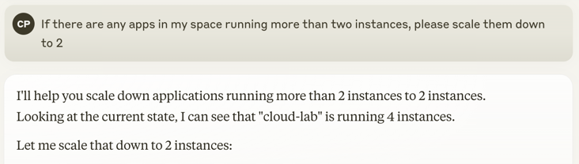

# Cloud Foundry MCP Server

A comprehensive Model Context Protocol (MCP) server that provides AI-powered access to Cloud Foundry operations through 31 specialized tools. Built with [Spring AI 1.1.0-M2](https://docs.spring.io/spring-ai/reference/api/mcp/mcp-server-boot-starter-docs.html) and deployed on Cloud Foundry.



## 🚀 Quick Start

### Deployed Server
The MCP server is deployed and running at: `https://cloud-foundry-mcp-server.apps.tp.penso.io`

### MCP Client Configuration
```json
{
  "mcpServers": {
    "cloud-foundry": {
      "disabled": false,
      "timeout": 60,
      "type": "sse",
      "url": "https://cloud-foundry-mcp-server.apps.tp.penso.io/sse",
      "autoApprove": []
    }
  }
}
```

## 🛠 Building & Deployment

### Build the Server
```bash
./mvnw clean package -DskipTests
```

### Deploy to Cloud Foundry
```bash
# Copy the template and configure with your credentials
cp manifest-template.yml manifest.yml
# Edit manifest.yml with your CF credentials
cf push cloud-foundry-mcp-server
```

### Local Development
```bash
# Run with local profile
./mvnw spring-boot:run -Dspring-boot.run.profiles=local
```

## ⚙️ Configuration

### Environment Variables
```bash
CF_APIHOST=api.sys.tp.penso.io
CF_USERNAME=admin
CF_PASSWORD=your-password
CF_ORG=tanzu-platform-demo
CF_SPACE=mcp-server
```

### Application Properties
```properties
spring.ai.mcp.server.name=cloud-foundry-mcp
spring.ai.mcp.server.version=1.0.0
spring.ai.mcp.server.prompt-change-notification=false
spring.ai.mcp.server.resource-change-notification=false

management.endpoints.web.exposure.include=health,info,mappings
management.endpoint.health.show-details=always

logging.level.io.modelcontextprotocol=DEBUG
logging.level.org.springframework.ai.mcp=DEBUG
```

## 🛠 Capabilities

This MCP server exposes **31 Cloud Foundry operations** as AI-powered tools:

### Application Management (8 tools)
- **applicationsList** - List applications in a CF space
- **applicationDetails** - Get detailed app information
- **pushApplication** - Deploy JAR files to CF
- **scaleApplication** - Scale app instances, memory, disk
- **startApplication** - Start CF applications
- **stopApplication** - Stop running applications
- **restartApplication** - Restart applications
- **deleteApplication** - Delete applications

### Organization & Space Management (8 tools)
- **organizationsList** - List all organizations
- **organizationDetails** - Get org details
- **spacesList** - List spaces in an org
- **getSpaceQuota** - Get space quota details
- **createSpace** - Create new spaces
- **deleteSpace** - Delete spaces
- **renameSpace** - Rename spaces
- **deleteOrphanedRoutes** - Clean up orphaned routes

### Service Management (6 tools)
- **serviceInstancesList** - List service instances
- **serviceInstanceDetails** - Get service instance details
- **serviceOfferingsList** - List marketplace services
- **bindServiceInstance** - Bind services to apps
- **unbindServiceInstance** - Unbind services from apps
- **deleteServiceInstance** - Delete service instances

### Route Management (6 tools)
- **routesList** - List routes in a space
- **createRoute** - Create new routes
- **deleteRoute** - Delete routes
- **mapRoute** - Map routes to applications
- **unmapRoute** - Unmap routes from applications
- **deleteOrphanedRoutes** - Clean up orphaned routes

### Network Policy Management (3 tools)
- **addNetworkPolicy** - Add network policies between apps
- **listNetworkPolicies** - List network policies
- **removeNetworkPolicy** - Remove network policies

### Application Cloning (1 tool)
- **cloneApp** - Clone existing applications with buildpack consistency

## 🔧 Technical Details

- **Spring AI Version**: 1.1.0-M2
- **Spring Boot Version**: 3.4.2
- **Java Version**: 21
- **Transport**: SSE (Server-Sent Events)
- **Health Endpoint**: `/actuator/health`
- **Default Org**: `tanzu-platform-demo`
- **Default Space**: `mcp-server`

## 📊 Health Status

The server provides comprehensive health monitoring:
- **Application Health**: Memory, disk, CPU usage
- **SSL/TLS Status**: Certificate validation
- **Cloud Foundry Connectivity**: API endpoint health
- **MCP Server Status**: Tool registration and transport health

## 🔒 Security

- **Credential Management**: Environment variable-based configuration
- **SSL/TLS**: HTTPS endpoints for secure communication
- **Authentication**: Cloud Foundry UAA integration
- **Authorization**: CF role-based access control

### 🔐 Credential Security

**Important**: The `manifest.yml` file contains sensitive credentials and is excluded from git via `.gitignore`.

- **Template**: Use `manifest-template.yml` as a starting point
- **Local Configuration**: Copy template and add your credentials
- **Environment Variables**: Credentials are passed via CF environment variables
- **Never Commit**: Actual manifest files with credentials should never be committed to git

## 📚 Documentation

- **Release Notes**: [RELEASE_NOTES.md](RELEASE_NOTES.md)
- **API Documentation**: Comprehensive tool descriptions
- **Configuration Guide**: Setup and deployment instructions
- **Troubleshooting**: Common issues and solutions

## 🤝 Contributing

1. Fork the repository
2. Create a feature branch
3. Make your changes
4. Add tests
5. Submit a pull request

## 📄 License

This project is licensed under the MIT License.

---

**Built with ❤️ using Spring AI and Cloud Foundry**
